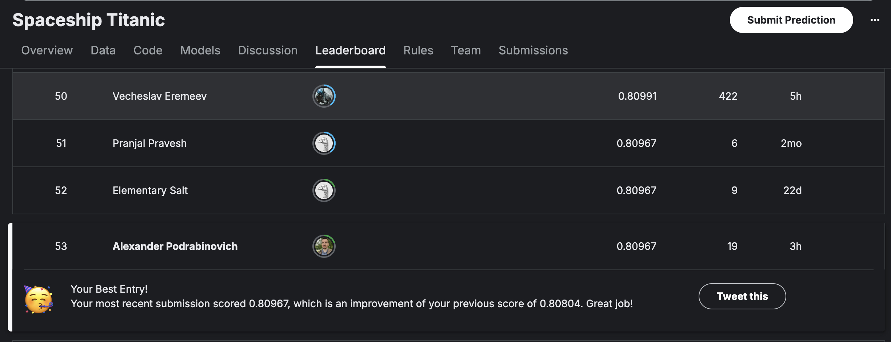

# Spaceship Titanic Competition

Различные эксперименты с обучением модели для сореванования https://www.kaggle.com/competitions/spaceship-titanic/.

Лучшая позиция в LB: 53 место из 2к+. Позиции в LB меняются каждый день, по итогу мой лучший LB Score = 0.80991

Финальный блокнот с выжимкой финализированной всех прочих блокнотов и экспериментов: neural_network_Final_Clean.ipynb.
